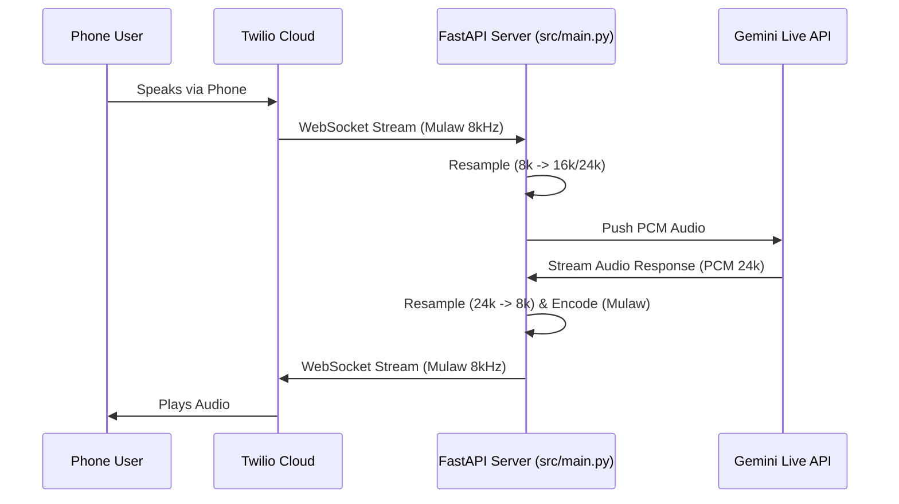

# Project Overview & Onboarding Guide

Welcome to the **Gemini Native Audio Realtime POC**! This guide is designed to help you understand the codebase, architecture, and how to get started.

## 🎯 Project Goal
This project demonstrates **real-time, bidirectional voice communication** with Google's Gemini 2.0 Flash model. It currently focuses on a **Telephony** use case, acting as a server that bridges phone calls (via Twilio) to the Gemini AI.

## 🏗️ Architecture
The system functions as a **WebSocket Bridge** between a telephony provider (Twilio) and Google Gemini.



## 🧩 Key Components

### 1. `src/main.py` (The Server)
- **Role**: Entry point. Runs a **FastAPI** application using `uvicorn`.
- **Key Functionality**: 
  - Exposes `/twilio` endpoints defined in `src/telephony/`.
  - Does *not* handle business logic itself, mostly setup and routing.

### 2. `src/telephony/media_stream.py` (The Bridge)
- **Role**: Handles the WebSocket connection from Twilio.
- **Key Logic**:
  - `media_stream(websocket)`: Main coroutine.
  - manages:
    - **Inbound Loop**: Receives `media` events from Twilio, decodes Mulaw, resamples, and puts into `mic_queue`.
    - **Outbound Loop**: Reads from `speaker_queue`, resamples to 8kHz, encodes to Mulaw, and sends to Twilio.
  - **Gemini Integration**: Instantiates `GeminiLiveClient` and connects the queues.

### 3. `src/gemini/client.py` (The Brain)
- **Role**: Wraps the `google-genai` SDK.
- **Key Logic**:
  - `start()`: Connects to Gemini Live API (`gemini-2.5-flash-native-audio-preview`).
  - **Parallel Loops**: Runs a sender loop (queue -> API) and a receiver loop (API -> queue).
  - Handles the `end_of_turn` and audio modality.

### 4. `src/audio/` (Local Audio - *Currently Unused*)
- Contains `audio_input.py` and `audio_output.py`.
- **Note**: These files are for a local microphone/speaker implementation (e.g., running locally on your laptop without Twilio).
- **Status**: Currently disconnected from `main.py`. The `README.md` instructions referencing "Speak into your microphone" technically refer to this logic, but `main.py` runs the Telephony server by default.

## 🛠️ Configuration
The project uses `python-dotenv` to load config from `.env`.
- `src/config/environment.py`: Centralized config accessor.
- **Critical Variables**:
  - `GEMINI_API_KEY`: Required for AI communication.
  - `TWILIO_...`: Required if you want to make/receive real calls.

## 🚀 Getting Started

1.  **Setup Environment**:
    ```bash
    python3 -m venv venv
    source venv/bin/activate
    pip install -r requirements.txt
    ```

2.  **Configure**:
    - Copy `.env.example` to `.env`.
    - Add your `GEMINI_API_KEY`.

3.  **Run the Server**:
    ```bash
    python src/main.py
    ```
    - The server starts on `http://0.0.0.0:8000`.

4.  **Testing**:
    - To test with **Twilio**: You need to tunnel your local port (e.g., using `ngrok http 8000`) and configure a Twilio Phone Number's Voice webhook to point to your ngrok URL (`/twilio/call/start` or handle incoming via TwiML).

## ⚠️ Known Issues / Gotchas
- **Audio Glitches**: Sample rate mismatches (8k vs 16k vs 24k) can cause robotic or sped-up audio. Check `resample_audio` in `src/telephony/audio_utils.py` if this happens.
- **README Discrepancy**: The root `README.md` implies a local CLI tool ("Speak into your mic"), but the code runs a Web Server. Use the explanations above to navigate this.
